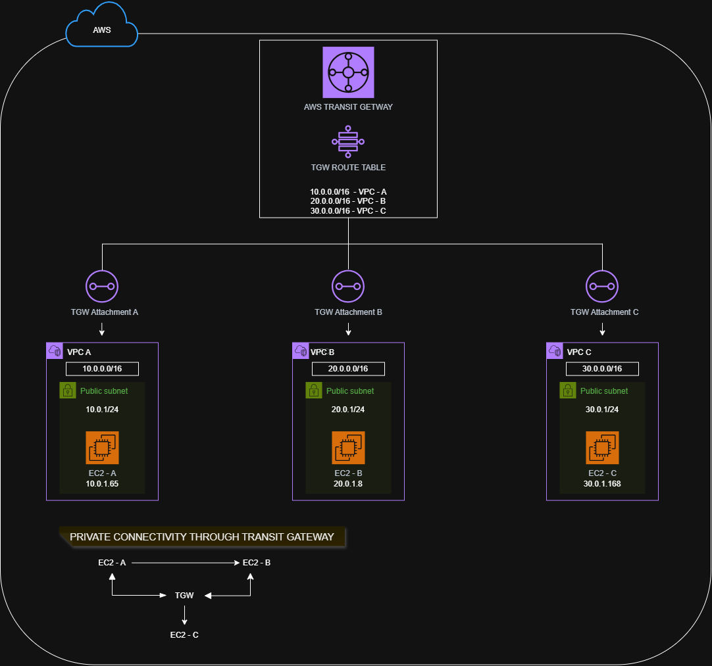

# AWS Transit Gateway Lab



## 📌 Overview

This project is a hands-on AWS Cloud Networking lab focused on **AWS Transit Gateway (TGW)** and the **hub-and-spoke network architecture**.

The objective was to build three separate VPCs and establish private network connectivity between them using a centralized Transit Gateway.

The lab was implemented from scratch, tested using real EC2 instances, documented with architecture diagrams and screenshots, and completely cleaned up after testing to minimize AWS costs.

---

# 🏗️ Architecture

The lab uses a hub-and-spoke architecture:

```text
                         AWS TRANSIT GATEWAY
                              TGW-HUB
                           /     |     \
                          /      |      \
                         /       |       \
                      VPC-A    VPC-B    VPC-C
                    10.0.0/16 20.0.0/16 30.0.0/16
                       |         |         |
                     EC2-A     EC2-B     EC2-C
                  10.0.1.65  20.0.1.8  30.0.1.168
